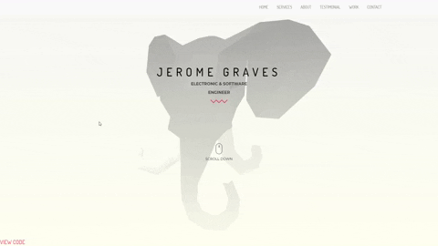

# aframe-vue-elephant-head

A tiny 3D web toy: an elephant head that turns to follow your mouse. Built with
[A-Frame](https://aframe.io/) (WebVR/WebGL) and Vue.js.



## Run

```bash
npm install
npm run serve     # dev server with hot reload
npm run build     # production build to dist/
```

Stack: Vue 2 + A-Frame 1.2.

## Credits

3D model: <https://skfb.ly/QUKq>. Free to reuse.

## License

MIT — see [`LICENSE`](LICENSE).
